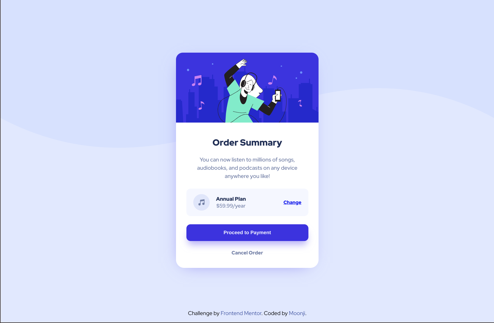
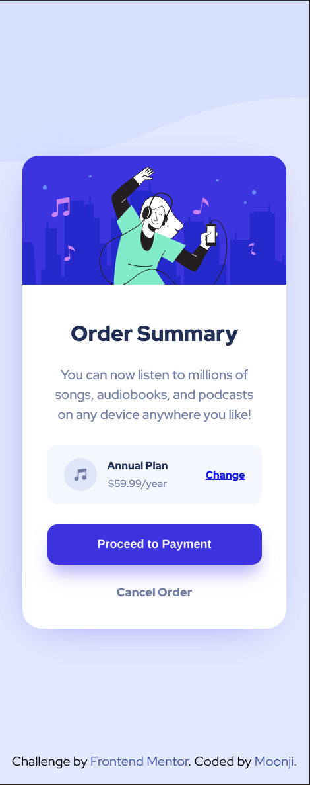

# Frontend Mentor - Order summary card solution

This is a solution to the [Order summary card challenge on Frontend Mentor](https://www.frontendmentor.io/challenges/order-summary-component-QlPmajDUj). Frontend Mentor challenges help you improve your coding skills by building realistic projects. 

## Table of contents

- [Overview](#overview)
  - [The challenge](#the-challenge)
  - [Screenshot](#screenshot)
  - [Links](#links)
- [My process](#my-process)
  - [Built with](#built-with)
  - [What I learned](#what-i-learned)
  - [Useful resources](#useful-resources)
- [Author](#author)

**Note: Delete this note and update the table of contents based on what sections you keep.**

## Overview

### The challenge

Users should be able to:

- See hover states for interactive elements

### Screenshot

<ins>Frontend Mentor's Desktop Design</ins>: 


<ins>My Desktop Solution</ins>: 



<ins>Frontend Mentor's Mobile Design</ins>:


<ins>My Mobile Solution</ins>:



### Links

- Solution URL: [Github](https://github.com/moonji-spoonji/Order-Summary-Card)
- Live Site URL: [Netlify](https://order-summary-card-moonji.netlify.app/)

## My process

### Built with

- Semantic HTML5 markup
- CSS custom properties
- Flexbox
- CSS Grid

### What I learned


```css
.card {
  box-shadow: -5px 10px 50px -25px hsl(245, 84%, 70%);
}

/* box-shadow: h-offset v-offset blur spread color; */
```

### Useful resources

- [FreeCodeCamp](https://www.freecodecamp.org/news/how-to-keep-your-footer-where-it-belongs-59c6aa05c59c/) - This article helped me position the footer at the bottom of the page instead of directly below the card component.

- [W3Schools](https://www.w3schools.com/cssref/css3_pr_box-shadow.php) - This is an amazing article which helped me finally understand how box-shadows work/are structured.

## Author

- Frontend Mentor - [@moonji-spoonji](https://www.frontendmentor.io/profile/moonji-spoonji) 
